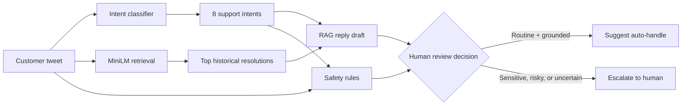

# Hiver AI Twitter Support Agent

An explainable support copilot for `@AppleSupport` built from real customer-support conversations on Twitter. The demo performs three jobs:

1. **Classify** an inbound message into one of eight support intents.
2. **Draft** a concise reply grounded in similar historical Apple Support resolutions.
3. **Triage** the message as `AUTO-HANDLE` or `ESCALATE TO HUMAN`, with a visible reason.

The product is intentionally human-in-the-loop: it recommends an action and drafts a response; it never silently sends a customer reply.

# Live demo

 **[Open the deployed Hiver Support Agent](https://hiver-working-project.streamlit.app/)**

 Try the prepared **Battery drain** and **Billing dispute** scenarios directly in the hosted app.

## Assignment deliverables

This README uses the same titles as the take-home assignment so each requirement can be checked quickly:

1. [Runnable repository and reproduction](#1-runnable-repository-and-reproduction)
2. [Golden evaluation set](#2-golden-evaluation-set)
3. [Evaluation harness and LLM-as-judge](#3-evaluation-harness-and-llm-as-a-judge)
4. [Report](#4-report)
5. [Decision log](#5-decision-log)

## How the system works



### What each stage means

| Stage | Output | Safety purpose |
| --- | --- | --- |
| Classify | One of eight support intents | Makes the request explainable |
| Retrieve | Similar historical customer/reply pairs | Grounds the draft in observed resolutions |
| Draft | Suggested reply, never an automatic send | Keeps a human in control |
| Triage | Auto-handle recommendation or escalation | Routes billing, account, legal, ambiguous, and risky cases |

## 1. Runnable repository and reproduction

### Windows PowerShell

```powershell
git clone https://github.com/JitinSaxenaa/Hiver.git
cd Hiver
python -m venv .venv
.\.venv\Scripts\Activate.ps1
python -m pip install -r requirements.txt
Copy-Item .env.example .env
python -m streamlit run app.py
```

Open **http://localhost:8501**. No API key is required for the local demo. If Ollama is unavailable, the classifier and reply generator use the deterministic local fallback rules.

### Deploy with Docker

The included image runs the demo with the checked-in processed corpus and local fallback:

```powershell
docker build -t hiver-support-agent .
docker run --rm -p 8501:8501 hiver-support-agent
```

For hosted LLM generation, pass secrets at runtime rather than baking them into the image:

```powershell
docker run --rm -p 8501:8501 `
  -e LLM_PROVIDER=openai `
  -e OPENAI_API_KEY=$env:OPENAI_API_KEY `
  -e OPENAI_MODEL=gpt-4o-mini `
  hiver-support-agent
```

This is a demo deployment, not a production customer-support service. Add authentication, persistent audit storage, rate limiting, PII redaction, and a human approval queue before connecting a live social account.

### Deploy on Streamlit Community Cloud

1. Push this repository to GitHub, including the deployable files under `data/processed/` and `models/`. Raw data and `.env` remain ignored.
2. Open [share.streamlit.io](https://share.streamlit.io), sign in with GitHub, and choose **New app**.
3. Select your repository, branch, and set the main file to `app.py`.
4. Deploy with Python 3.11 if the advanced settings are available.
5. Leave the app in local mode for a zero-API demo. For hosted reply generation, open **App settings > Secrets** and paste the values from `.streamlit/secrets.toml.example` with a real key.

The deployed app defaults to `LLM_PROVIDER=local`, so it does not hang when Ollama is unavailable. OpenAI is optional and only used when configured through Streamlit Secrets. Never paste API keys into the repository, README, screenshots, or video.

#### API key safety

The key must be added only in Streamlit Cloud Secrets:

```toml
LLM_PROVIDER = "openai"
OPENAI_API_KEY = "your-rotated-key"
OPENAI_MODEL = "gpt-4o-mini"
```

If a key is ever pasted into chat, GitHub, a screenshot, a terminal command, or a committed file, revoke it immediately and create a replacement. This repository intentionally contains no real key.

## 2. Golden evaluation set

The repository includes a **200-example hand-labelled evaluation set**, within the required 150–250 range:

- Dataset: [eval/golden_set.csv](eval/golden_set.csv)
- Sampling and labeling methodology: [eval/golden_set_notes.md](eval/golden_set_notes.md)
- The set uses held-out AppleSupport examples, eight intent labels, ideal routing decisions, and reference reply directions.
- The notes document the corpus split, stratified sampling, annotation rules, and single-annotator limitation.

## 3. Evaluation harness and LLM-as-a-judge

The evaluation harness compares the system with two baselines and evaluates classification, safety routing, and reply quality:

- Harness: [eval/run_eval.py](eval/run_eval.py)
- LLM-as-judge rubric: [eval/llm_judge.py](eval/llm_judge.py)
- Human-agreement calibration code: [eval/human_agreement.py](eval/human_agreement.py)
- Recorded results: [eval/eval_results.json](eval/eval_results.json)

Run it with:

```powershell
python -m eval.run_eval
```

The harness includes a trivial majority-class baseline, a TF-IDF + Logistic Regression baseline, intent metrics, escalation precision/recall/F1, false-positive and false-negative analysis, and a five-dimension reply rubric. The reported human-agreement figures must be treated as calibration artifacts until independently collected human ratings are added; the current evaluator does not claim independent human validation.

## 4. Report

The full assignment report is [report/REPORT.md](report/REPORT.md). It covers:

- Problem framing and what “good” means for @AppleSupport.
- Explicit out-of-scope decisions.
- Results against the trivial and TF-IDF baselines.
- Top five failure modes with real examples and hypotheses.
- The mandatory section explaining what is misleading about the headline number.
- The plan for one more week of engineering.

The current headline results are also summarized below for quick review.

## Using the demo

1. Open **Agent demo**.
2. Click a prepared scenario such as **Billing dispute** or **Battery drain**.
3. Click **Process message**.
4. Explain the output from top to bottom:
   - **Intent and confidence:** what the customer needs.
   - **Grounding:** how closely the message matches resolved historical cases.
   - **Suggested response:** the brand-aligned draft.
   - **Decision:** whether the risk rules allow auto-handling.
   - **Grounding evidence:** the exact historical cases used by retrieval.
5. Use **Evaluation** to compare against the majority-class and TF-IDF baselines.
6. Use **Intent guide** to explain the taxonomy and out-of-scope boundaries.

### Headline evaluation results

| Area | Result |
| --- | ---: |
| Intent accuracy (recorded local benchmark) | **85.50%** |
| Intent macro F1 (recorded local benchmark) | **0.8370** |
| TF-IDF baseline accuracy | 76.50% |
| Escalation recall | 67.14% |
| Reply-quality score (recorded benchmark) | 3.78 / 5.0 |
| Golden examples | 200 |

These are recorded repository benchmark results, not an independent certification. Re-run `python -m eval.run_eval --provider local` after cloning to regenerate them. The classification and triage numbers come from the checked-in 200-example golden set and the evaluation code. Reply quality uses an LLM-as-judge when a provider is configured; otherwise it uses the deterministic rubric fallback. Independent human-agreement statistics are intentionally not claimed by the current evaluator. Results can change if the data, cache, provider, prompt, or labels change. Accuracy is affected by class imbalance and the golden set was labelled by one annotator. The full discussion is in [report/REPORT.md](report/REPORT.md).

## 5. Decision log

The repository records **13 non-obvious engineering decisions** and their rationales in [report/DECISION_LOG.md](report/DECISION_LOG.md), including:

- Brand selection and sampling budget.
- Time-stratified sampling and the eight-intent taxonomy.
- Retrieval leakage prevention.
- Escalation safety policy.
- Baseline design and evaluation limitations.

## Repository map

```text
app.py                         Streamlit application
src/classify.py                Intent classification and local fallback
src/retrieve.py                Semantic retrieval with leave-one-out guards
src/draft_reply.py             RAG-grounded reply generation
src/escalate.py                Risk-weighted human escalation
src/pipeline.py                End-to-end pipeline entrypoint
eval/golden_set.csv            200 hand-labelled evaluation examples
eval/run_eval.py               Evaluation harness
report/REPORT.md               Results, failure analysis, limitations
report/DECISION_LOG.md         Non-obvious architecture decisions
```

## References

- Dataset: `thoughtvector/customer-support-on-twitter`
- Model: `sentence-transformers/all-MiniLM-L6-v2`
- See [CITATIONS.md](CITATIONS.md) for dataset and library citations.
